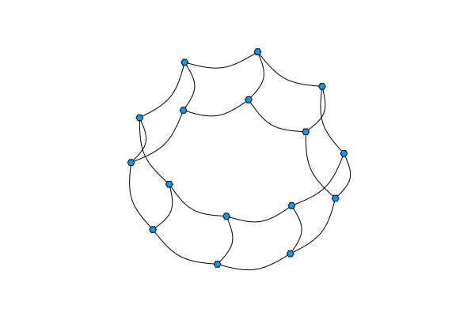
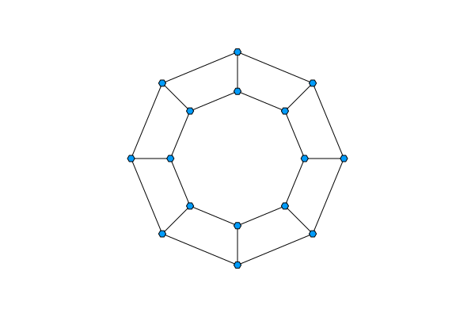
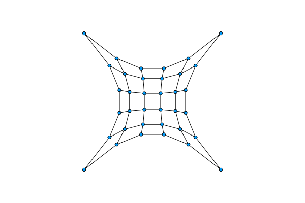
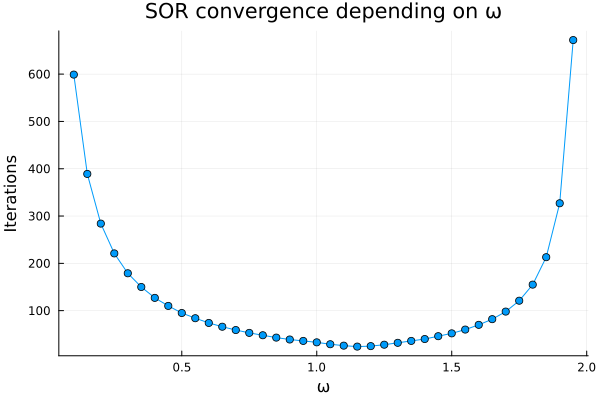

---
header-includes:
  - \usepackage{float}
  - \floatplacement{figure}{H}
---

# Implementacija redkih matrik in metode SOR

**Matej Rupnik**

---

## Opis problema

Obravnavamo reševanje linearnega sistema

$$
A x = b,
$$

kjer je $A \in \mathbb{R}^{n \times n}$ razpršena matrika. Ker je pri takšnih matrikah večina elementov enaka nič, klasična gosta predstavitev matrike ni učinkovita ne prostorsko ne računsko. Zato shranjujemo le neničelne elemente in njihove indekse.

Za reševanje sistema uporabimo iterativno metodo SOR (Successive Over-Relaxation), ki predstavlja razširitev Gauss–Seidlove metode z relaksacijskim parametrom $\omega$. Pri izbiri

$$
\omega = 1
$$

dobimo Gauss–Seidlovo metodo, medtem ko vrednosti

$$
0 < \omega < 1
$$

predstavljajo podrelaksacijo, vrednosti

$$
1 < \omega < 2
$$

pa nadrelaksacijo, ki lahko pospeši konvergenco metode.

Iteracije ustavimo, ko velja

$$
\|Ax^{(k)} - b\|_\infty < \delta.
$$

Metodo nato uporabimo pri fizikalni vložitvi grafov v ravnino oziroma prostor.

---

## Redka matrika

Razpršene matrike predstavimo s strukturo tipa `RedkaMatrika`:

```julia
struct RedkaMatrika
    V::Vector{Vector{Float64}}
    I::Vector{Vector{Int}}
    n::Int
end
```

Vsaka vrstica matrike je predstavljena z dvema seznamoma:

- `V[i]` vsebuje neničelne vrednosti v vrstici $i$,
- `I[i]` vsebuje pripadajoče stolpčne indekse.

Takšna predstavitev ustreza formatu LIL (List of Lists), ki je posebej primeren za iterativne metode in množenje matrike z vektorjem.

Implementirali smo osnovne operacije nad matrikami:

- indeksiranje elementov,
- spreminjanje vrednosti,
- množenje z vektorjem,
- seštevanje, odštevanje in množenje s skalarjem,
- pretvorbo med gosto in razpršeno predstavitvijo.

Najpomembnejša operacija za metodo SOR je množenje matrike z vektorjem:

```julia
function Base.:*(A::RedkaMatrika, x::Vector{Float64})
    y = zeros(A.n)

    for i in 1:A.n
        for (val, j) in zip(A.V[i], A.I[i])
            y[i] += val * x[j]
        end
    end

    return y
end
```

---

## SOR metoda

Za reševanje sistema

$$
A x = b
$$

uporabimo iterativno metodo SOR.

```julia
function sor(A::RedkaMatrika,
             b::Vector{Float64},
             omega::Float64 = 1.0,
             tol = 1e-10)

    max_iterations = 10_000
    n = A.n
    x = zeros(n)

    for iteration in 1:max_iterations
        for row in 1:n
            diagonal_entry, row_sum = rowTerms(A, row, x)

            x[row] = (1 - omega) * x[row] +
                     (omega / diagonal_entry) *
                     (b[row] - row_sum)
        end

        residual = A * x - b

        if norm(residual, Inf) < tol:
            return x, iteration
        end
    end

    error("Convergence not achieved")
end
```

---

## Fizikalna vložitev grafov

### Krožna lestev





### Vložitev 2D mreže



---

## Rezultati

V naših primerih se je optimalna vrednost parametra pojavila pri približno

$$
\omega \approx 1.1 - 1.2
$$


