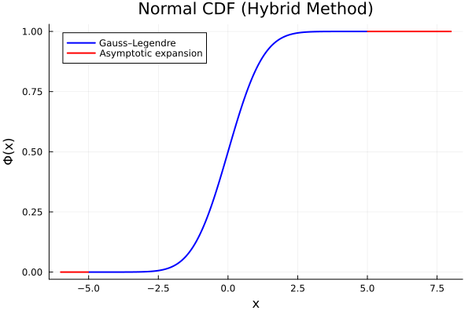

# Numerične metode standardne normalne porazdelitvene funkcije (CDF)

Ta modul implementira numerične aproksimacije standardne normalne kumulativne porazdelitvene funkcije (CDF) z uporabo dveh dopolnjujočih pristopov:

- Gauss--Legendre kvadratura (visoka natančnost v osrednjem območju)
- Asimptotična razširitev (stabilna za repne verjetnosti)
- Hibridna metoda, ki združuje oba pristopa

---

## Matematična definicija

Standardna normalna CDF je definirana kot:

$$ \Phi(x) = \frac{1}{\sqrt{2\pi}} \int_{-\infty}^{x} \exp\left(-\frac{t^2}{2}\right)\, dt $$

Ker ta integral nima zaprte oblike, so potrebne numerične metode.

---

## Implementirane metode

### 1. Gauss--Legendre kvadratura

Ta metoda numerično izračuna integral z uporabo Gauss--Legendre vozlišč in uteži.

**Uporaba:**  
Visoka natančnost za zmerne vrednosti $x$ v intervalu $[-5, 5]$.

---

### 2. Asimptotična razširitev

Uporablja se za velike pozitivne vrednosti $x$ in aproksimira Gaussov rep:

$$ Q(x) = 1 - \Phi(x) $$

$$ Q(x) \approx \frac{e^{-x^2/2}}{x\sqrt{2\pi}} \left(1 + \text{členi vrste}\right) $$

Ta metoda je stabilna za velike $x$.

---

### 3. Hibridna metoda

- $x \le 5$ -- Gauss--Legendre kvadratura  
- $x > 5$ -- asimptotična razširitev  

---

## Podrobnosti implementacije

- Red kvadrature: $N = 20$
- Knjižnica: FastGaussQuadrature
- Vnaprej izračunana vozlišča in uteži

---

## Rezultati

