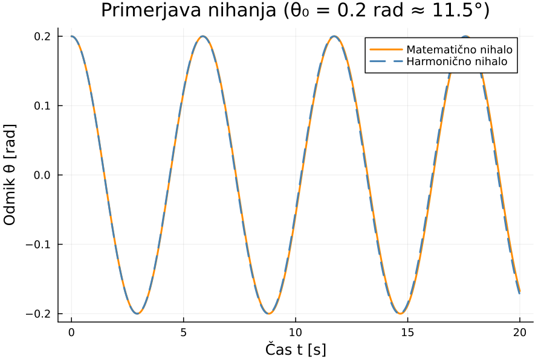
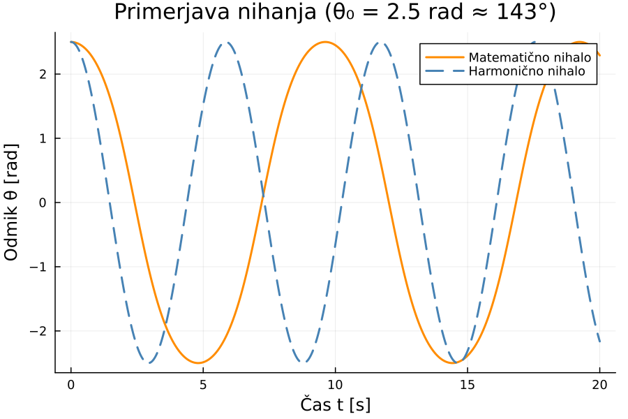
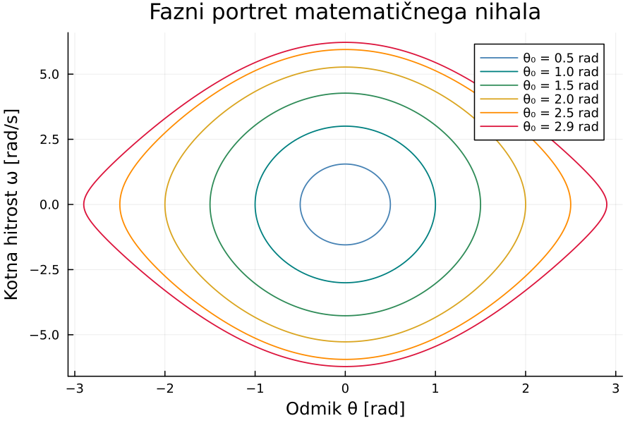
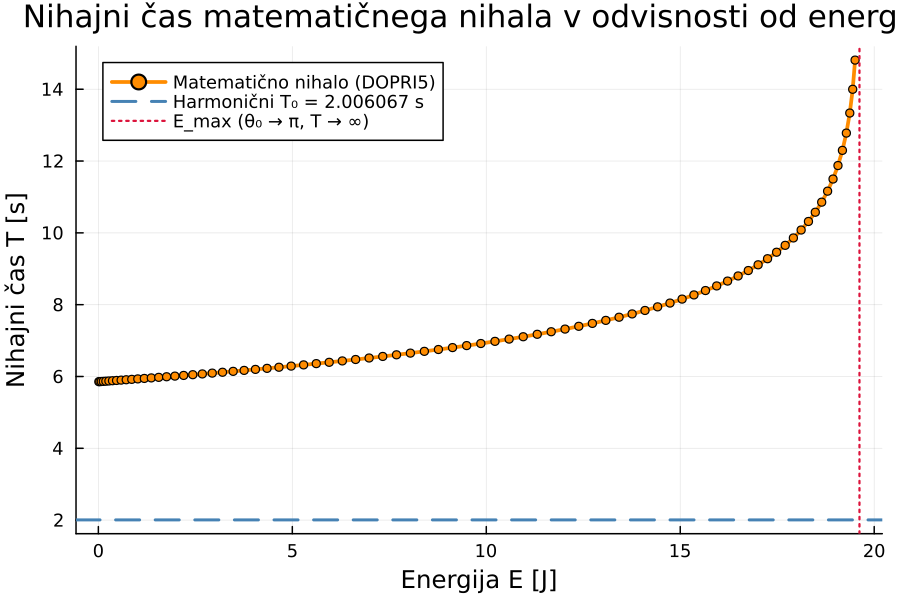

---
header-includes:
  - \usepackage{float}
  - \floatplacement{figure}{H}
---

# Numerična rešitev matematičnega nihala (DOPRI5)

Ta modul implementira numerično simulacijo matematičnega nihala z uporabo
adaptivnega Dormand--Prince RK45 (DOPRI5) integratorja z vgrajenim
nadzorom napake.

- Pretvorba diferencialne enačbe drugega reda na sistem prvega reda
- Adaptivni DOPRI5 korak z oceno lokalne napake (4. vs. 5. red)
- Linearna interpolacija ničelnih prehodov za natančno določitev nihajnega časa
- Primerjava matematičnega in harmoničnega nihala
- Graf odvisnosti nihajnega časa od energije nihala

---

## Matematična definicija

### Matematično nihalo

Kotni odmik $\theta(t)$ pri nedušenem nihanju opisuje diferencialna enačba drugega reda:

$$\frac{g}{l} \sin(\theta(t)) + \ddot{\theta}(t) = 0, \quad \theta(0) = \theta_0,\quad \dot{\theta}(0) = \dot{\theta}_0$$

kjer je $g$ težni pospešek in $l$ dolžina nihala.

### Pretvorba na sistem prvega reda

Uvedemo stanje $u = [\theta,\, \omega]^\top$, kjer je $\omega = \dot{\theta}$:

$$\dot{u} = f(u) = \begin{bmatrix} \omega \\ -\dfrac{g}{l}\sin(\theta) \end{bmatrix}$$

### Harmonično nihalo

Za majhne odmike velja $\sin\theta \approx \theta$, kar da lineariziran sistem:

$$\frac{g}{l}\,\theta(t) + \ddot{\theta}(t) = 0$$

$$\dot{u} = f_{\text{harm}}(u) = \begin{bmatrix} \omega \\ -\dfrac{g}{l}\,\theta \end{bmatrix}$$

Harmonični nihajni čas je neodvisen od začetnih pogojev:

$$T_0 = 2\pi\sqrt{\frac{l}{g}}$$

---

## Implementirane metode

### 1. DOPRI5 korak

En korak Dormand--Prince RK45 z $s = 6$ stopnjami:

$$k_i = f\!\left(u_n + h \sum_{j=1}^{i-1} a_{ij}\, k_j\right), \quad i = 1,\ldots,6$$

**Rešitev 5. reda:**

$$u_{n+1}^{(5)} = u_n + h\sum_{i=1}^{6} b_i\, k_i$$

**Vgrajena ocena lokalne napake** (razlika med 5. in 4. redom, FSAL):

$$e = h \sum_{i=1}^{7} (b_i - b_i^*)\, k_i$$

Butcherjev tableau (Dormand--Prince):

| | $a_{i1}$ | $a_{i2}$ | $a_{i3}$ | $a_{i4}$ | $a_{i5}$ | $a_{i6}$ |
|---|---|---|---|---|---|---|
| $k_2$ | $\tfrac{1}{5}$ | | | | | |
| $k_3$ | $\tfrac{3}{40}$ | $\tfrac{9}{40}$ | | | | |
| $k_4$ | $\tfrac{44}{45}$ | $-\tfrac{56}{15}$ | $\tfrac{32}{9}$ | | | |
| $k_5$ | $\tfrac{19372}{6561}$ | $-\tfrac{25360}{2187}$ | $\tfrac{64448}{6561}$ | $-\tfrac{212}{729}$ | | |
| $k_6$ | $\tfrac{9017}{3168}$ | $-\tfrac{355}{33}$ | $\tfrac{46732}{5247}$ | $\tfrac{49}{176}$ | $-\tfrac{5103}{18656}$ | |

---

### 2. Adaptivni nadzor koraka

Napaka se oceni z mešano toleranco:

$$\mathrm{sc}_i = \mathrm{atol} + \mathrm{rtol} \cdot \max(|u_i|,\,|u_i^{\text{new}}|)$$

$$\mathrm{err} = \sqrt{\frac{1}{n}\sum_{i=1}^{n}\left(\frac{e_i}{\mathrm{sc}_i}\right)^2}$$

Naslednji korak se določi s PI-krmilnikom:

$$h_{\text{new}} = h \cdot \min\!\left(5,\;\max\!\left(0.2,\;0.9 \cdot \left(\frac{1}{\mathrm{err}}\right)^{1/5}\right)\right)$$

Korak se ponovi, če $\mathrm{err} > 1$.

**Ciljna natančnost:** `rtol = atol = 1e-11`, kar zagotavlja vsaj 10 decimalk.

---

### 3. Linearna interpolacija ničelnih prehodov

Nihajni čas se določi z linearno interpolacijo pri vsakem naraščajočem ničelnem prehodu $\theta$:

$$t_{\text{prehod}} = t_{\text{old}} + \frac{-\theta_{\text{old}}}{\theta_{\text{new}} - \theta_{\text{old}}} \cdot h$$

To zmanjša napako ocene nihajnega časa iz $O(h)$ na $O(h^2)$, kar skupaj z adaptivnim korakom zagotavlja zahtevano natančnost.

Nihajni čas se izračuna kot povprečje vseh zaznanih celotnih nihanj:

$$T = \frac{1}{N}\sum_{k=1}^{N}(t_{k+1} - t_k)$$

---

### 4. Energija nihala

Skupna mehanska energija nihala:

$$E = \frac{1}{2}\,l^2\,\omega^2 + g\,l\,(1 - \cos\theta)$$

Za začetne pogoje $\omega_0 = 0$:

$$E = g\,l\,(1 - \cos\theta_0)$$

---

## Rezultati

### Primerjava pri majhnem odmiku ($\theta_0 = 0.2\ \mathrm{rad} \approx 11.5°$)

Pri majhnih odmikah sta rešitvi praktično enaki -- razlika nihajnih časov je reda $10^{-4}\ \mathrm{s}$.

---

### Primerjava pri velikem odmiku ($\theta_0 = 2.5\ \mathrm{rad} \approx 143°$)

Pri velikih odmikah harmonično nihalo podceni nihajni čas -- faza se vidno zamakne že po prvem nihaju.

---

### Fazni portret matematičnega nihala

---

### Nihajni čas v odvisnosti od energije

Pri harmoničnem nihalu je nihajni čas $T_0$ neodvisen od energije. Pri matematičnem nihalu nihajni čas narašča z energijo in divergira, ko se začetni odmik bliža $\theta_0 \to \pi$ (nihalo se uravnoteži v zgornji legi, $E \to 2gl$).

$$\lim_{\theta_0 \to \pi} T(\theta_0) = +\infty$$

